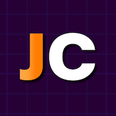

<!-- PROJECT LOGO -->
<p align="center">
  <a href="https://github.com/AykutSarac/jsoncrack.com">
   
  </a>

  <h1 align="center">JSON Crack</h1>

  <p align="center">
    开源的 JSON 编辑器
    <br />
    <a href="https://jsoncrack.com"><strong>了解更多 »</strong></a>
    <br />
    <br />
    <a href="https://todiagram.com">ToDiagram</a>
    ·
    <a href="https://discord.gg/yVyTtCRueq">Discord</a>
    ·
    <a href="https://jsoncrack.com">官网</a>
    ·
    <a href="https://github.com/AykutSarac/jsoncrack.com/issues">问题反馈</a>
    ·
    <a href="https://marketplace.visualstudio.com/items?itemName=AykutSarac.jsoncrack-vscode">VS Code 扩展</a>
  </p>
</p>

<!-- ABOUT THE PROJECT -->

## 关于项目


## 将 JSON 可视化为交互式图表

JSON Crack 是一个用于将 JSON 数据可视化为结构化交互式图表的工具，让数据探索、格式化和验证变得更加简单。它提供了数据格式转换（CSV、YAML）、生成 JSON Schema、执行查询以及导出可视化图像等功能。专为可读性和易用性而设计。

* **可视化**: 即时将 JSON、YAML、CSV、XML 和 TOML 转换为交互式图表或树形结构，支持深色和浅色模式。
* **格式转换**: 无缝转换数据格式，如 JSON 转 CSV 或 XML 转 JSON，便于分享。
* **格式化与验证**: 美化和验证 JSON、YAML 和 CSV，确保数据清晰准确。
* **代码生成**: 生成 TypeScript 接口、Golang 结构体和 JSON Schema。
* **JSON Schema**: 创建 JSON Schema、模拟数据并验证各种数据格式。
* **高级工具**: 解码 JWT、随机化数据、运行 jq 或 JSON path 查询。
* **导出图像**: 将可视化结果下载为 PNG、JPEG 或 SVG 格式。
* **隐私保护**: 所有数据处理都在本地进行，服务器不存储任何数据。

## 荣誉

<a href="https://news.ycombinator.com/item?id=32626873">
  
</a>

<a href="https://producthunt.com/posts/JSON-Crack?utm_source=badge-featured&utm_medium=badge&utm_souce=badge-jsoncrack" target="_blank"></a>

### 技术栈

- [Next.js](https://nextjs.org/?ref=jsoncrack.com)
- [React.js](https://reactjs.org/?ref=jsoncrack.com)
- [Reaflow](https://reaflow.dev/?ref=jsoncrack.com)
- [Monaco Editor](https://github.com/suren-atoyan/monaco-react)

## 保持更新

JSON Crack 于 2022 年 2 月 17 日正式发布 v1.0 版本，至今已取得长足进展。关注本仓库的 **releases** 以获取未来更新通知：

<a href="https://github.com/AykutSarac/jsoncrack.com"></a>

<!-- GETTING STARTED -->

## 快速开始

按照以下步骤在本地运行项目。

### 前置要求

运行 JSON Crack 需要：

- Node.js (版本: >=18.x)
- Pnpm _(推荐)_


## 开发

### 安装步骤

1. 克隆仓库到本地（或 fork https://github.com/AykutSarac/jsoncrack.com/fork）。如果计划分发代码，请阅读 [`LICENSE`](/LICENSE.md) 了解更多详情。

   ```sh
   git clone https://github.com/AykutSarac/jsoncrack.com.git
   ```

2. 进入项目目录

   ```sh
   cd jsoncrack.com
   ```

3. 安装依赖

   ```sh
   pnpm install
   ```

4. 运行项目

   ```sh
   pnpm dev

   # 运行在 http://localhost:3078/
   ```

### Docker

🐳 项目根目录提供了 [`Dockerfile`](Dockerfile)。
如果你想在本地通过 Docker 运行 JSON Crack：

```console
# 构建 Docker 镜像：
docker compose build

# 使用 docker-compose 本地运行
docker compose up

# 访问 http://localhost:8888
```

## 配置

可以通过编辑项目根目录 `.env` 文件中的 `NEXT_PUBLIC_NODE_LIMIT` 值来更改支持的节点数量限制。

<!-- LICENSE -->

## 许可证

查看 [`LICENSE`](/LICENSE.md) 了解更多信息。
